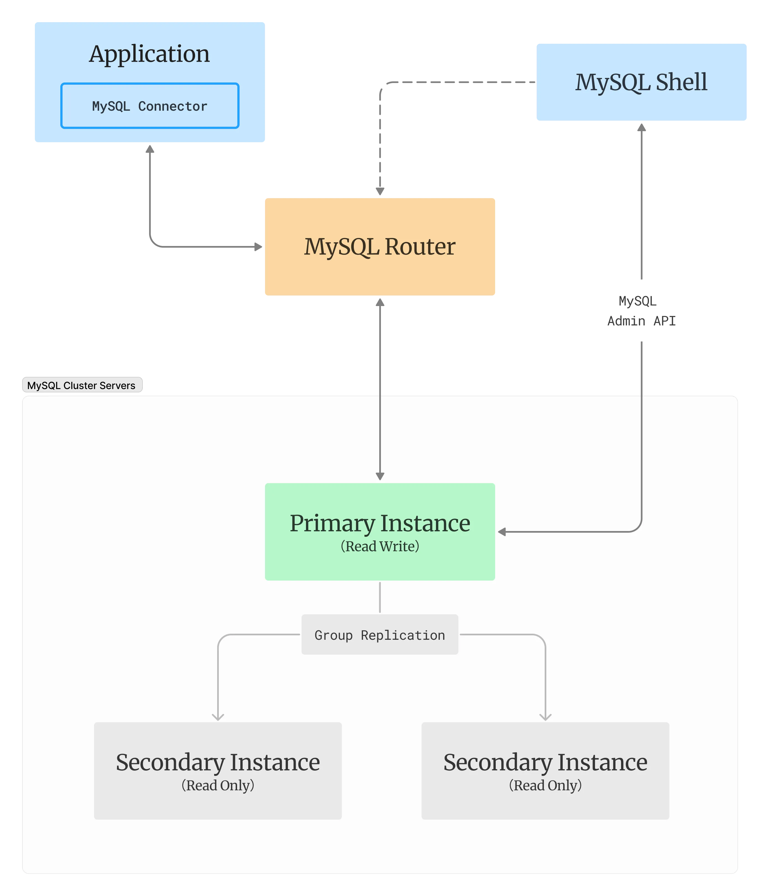

### MySQL InnoDB Cluster 介绍

MySQL InnoDB Cluster 是 MySQL 官方提供的一种高可用解决方案，它基于 MySQL Group Replication、MySQL Router 和 MySQL Shell 构建。

MySQL Group Replication，简称 MGR，采用 Group Communication System (GCS) 协议提供了包括故障检测机制、组成员服务以及安全且完全有序的消息传递能力，底层采用分布式共识和一致性算法 Paxos 实现。

MySQL Router 是一款轻量级中间件，在我们的应用程序和后端 MySQL 服务器节点之间提供透明路由，将请求到数据库的流量路由到适当的后端 MySQL 服务器来提供高可用性和可扩展性。

MySQL Shell 则提供了便捷运维和配置集群所需的工具和机制，让我们能够轻而易举的构建易于管理、高可用性的数据库集群。

MySQL InnoDB Cluster 的主要价值如下：
1. 高可用性：InnoDB Cluster 可以实现数据库的多主复制或者主从复制，确保在主节点故障时自动切换到备用主节点，实现高可用性和容错能力，避免单点故障。
2. 数据一致性：InnoDB Cluster 使用强一致性复制模型（a shared-nothing replication scheme），所有写操作均在主节点上进行，并复制同步到其他节点，从而保证数据的一致性。
3. 简化管理：InnoDB Cluster 提供了一组工具和命令行接口，使集群的部署、配置和管理变得简单和易于操作。您可以使用 MySQL Shell 进行集群管理、监控和故障处理，而无需手动处理复杂的配置文件或命令。
4. 扩展性：InnoDB Cluster 支持动态增加和移除节点，使得集群节点的扩展和缩减变得非常容易。运维人员可以根据实际需要添加更多的节点来处理更高的负载，或者移除节点以减少资源消耗。
5. 读写分离：通过结合 MySQL Router，InnoDB Cluster 支持读写分离，允许将读操作分发到多个从节点，从而提高读取性能，这可以通过 MySQL Router 的负载均衡和路由功能实现，将读请求分发到可用的从节点上。


### 架构图



### 部署过程

##### 部署 MySQL Server 和 MySQL Router

我们需要部署一个三节点组成的 MySQL Group Replication 组织和一个 MySQL Router 容器，这里我们使用 Docker-compose 来完成，MySQL Group Replication 所需配置的详细说明请参考[官方文档](https://dev.mysql.com/doc/refman/8.0/en/group-replication-configuring-instances.html)，此处给出的配置已经过验证，供参考。 Docker-compose.yaml 内容如下：

```yaml
services:
  mysql1:
    image: mysql/mysql-server:8.0.32
    container_name: mysql1
    hostname: mysql1
    volumes:
      - ./1:/var/lib/mysql
    ports:
      - "3306:3306"
    restart: unless-stopped
    environment:
      - MYSQL_ROOT_PASSWORD=mypass
    command: ["mysqld",
      "--server-id=1",
      "--disabled-storage-engines=MyISAM,BLACKHOLE,FEDERATED,ARCHIVE,MEMORY",
      "--log-bin=mysql-bin-1.log",
      "--enforce-gtid-consistency=ON",
      "--log-slave-updates=ON",
      "--gtid-mode=ON",
      "--transaction-write-set-extraction=XXHASH64",
      "--binlog-checksum=NONE",
      "--master-info-repository=TABLE",
      "--relay-log-info-repository=TABLE",
      "--plugin-load=group_replication.so",
      "--relay-log-recovery=ON",
      "--default-authentication-plugin=mysql_native_password",
      "--loose-group-replication-start-on-boot=OFF",
      "--loose-group-replication-group-name=2a1b5cc4-fa14-11ed-be56-0242ac120002",
      "--loose-group-replication-local-address=mysql1:33061",
      "--loose-group-replication-group-seeds=mysql1:33061,mysql2:33061,mysql3:33061",
      "--loose-group-replication-single-primary-mode=ON",
      "--loose-group-replication-enforce-update-everywhere-checks=OFF"]
    healthcheck:
      test: "mysqladmin ping -u root -p$${MYSQL_ROOT_PASSWORD}"
      interval: 2s
      retries: 20

  mysql2:
    image: mysql/mysql-server:8.0.32
    container_name: mysql2
    hostname: mysql2
    volumes:
      - ./2:/var/lib/mysql
    ports:
      - "3307:3306"
    restart: unless-stopped
    environment:
      - MYSQL_ROOT_PASSWORD=mypass
    command: ["mysqld",
      "--server-id=2",
      "--disabled-storage-engines=MyISAM,BLACKHOLE,FEDERATED,ARCHIVE,MEMORY",
      "--log-bin=mysql-bin-1.log",
      "--enforce-gtid-consistency=ON",
      "--log-slave-updates=ON",
      "--gtid-mode=ON",
      "--transaction-write-set-extraction=XXHASH64",
      "--binlog-checksum=NONE",
      "--master-info-repository=TABLE",
      "--relay-log-info-repository=TABLE",
      "--plugin-load=group_replication.so",
      "--relay-log-recovery=ON",
      "--default-authentication-plugin=mysql_native_password",
      "--loose-group-replication-start-on-boot=OFF",
      "--loose-group-replication-group-name=2a1b5cc4-fa14-11ed-be56-0242ac120002",
      "--loose-group-replication-local-address=mysql2:33061",
      "--loose-group-replication-group-seeds=mysql1:33061,mysql2:33061,mysql3:33061",
      "--loose-group-replication-single-primary-mode=ON",
      "--loose-group-replication-enforce-update-everywhere-checks=OFF"]
    healthcheck:
      test: "mysqladmin ping -u root -p$${MYSQL_ROOT_PASSWORD}"
      interval: 2s
      retries: 20

  mysql3:
    image: mysql/mysql-server:8.0.32
    container_name: mysql3
    hostname: mysql3
    volumes:
      - ./3:/var/lib/mysql
    ports:
      - "3308:3306"
    restart: unless-stopped
    environment:
      - MYSQL_ROOT_PASSWORD=mypass
    command: ["mysqld",
      "--server-id=3",
      "--disabled-storage-engines=MyISAM,BLACKHOLE,FEDERATED,ARCHIVE,MEMORY",
      "--log-bin=mysql-bin-1.log",
      "--enforce-gtid-consistency=ON",
      "--log-slave-updates=ON",
      "--gtid-mode=ON",
      "--transaction-write-set-extraction=XXHASH64",
      "--binlog-checksum=NONE",
      "--master-info-repository=TABLE",
      "--relay-log-info-repository=TABLE",
      "--plugin-load=group_replication.so",
      "--relay-log-recovery=ON",
      "--default-authentication-plugin=mysql_native_password",
      "--loose-group-replication-start-on-boot=OFF",
      "--loose-group-replication-group-name=2a1b5cc4-fa14-11ed-be56-0242ac120002",
      "--loose-group-replication-local-address=mysql3:33061",
      "--loose-group-replication-group-seeds=mysql1:33061,mysql2:33061,mysql3:33061",
      "--loose-group-replication-single-primary-mode=ON",
      "--loose-group-replication-enforce-update-everywhere-checks=OFF"]
    healthcheck:
      test: "mysqladmin ping -u root -p$${MYSQL_ROOT_PASSWORD}"
      interval: 2s
      retries: 20
      
  mysql-router:
    image: mysql/mysql-router:8.0
    container_name: mysql-router
    hostname: mysql-router
    ports:
      - "6446:6446"
    restart: on-failure
    environment:
      - MYSQL_HOST=mysql1
      - MYSQL_PORT=3306
      - MYSQL_USER=clusteradmin
      - MYSQL_PASSWORD=mypass
      - MYSQL_INNODB_CLUSTER_MEMBERS=3
    depends_on:
      - mysql1
      - mysql2
      - mysql3
```

其中有几点部署生产环境时需要注意

* 生产环境建议将三个节点分配到不同的服务器上以避免服务器故障时所有节点都不能使用，提高容错性，此时 --loose-group-replication-local-address 和 --loose-group-replication-group-seeds 需使用对应的 IP 和 端口，确保节点之间的通信正常
* 生产环境建议使用更高效更安全的身份验证插件，这里使用mysql_native_password 为了更好的兼容性
* 生产环境不能将 MYSQL_ROOT_PASSWORD 直接配置在 Docker-compose 文件中，建议采用更加安全的方式管理各种密码，比如 docker secret
* 生产环境建议要积极采用各种安全措施，比如使用 SSL 加密保护所有的通信过程、配置 --group-replication-ip-allowlist=value 等
* 生产环境我们可以部署多个 Router 副本以避免 Router 成为系统单点瓶颈，可以用负载均衡器将请求分发到 Router 副本上，也可以每个应用使用单独的 Router 副本，此处不再展开

在 docker-compose.yaml 所在目录下执行 docker-compose up -d 启动容器，成功执行之后，使用 docker-compose ps 检查结果，预期结果为 3 个 MySQL 节点顺利启动，并保持 Healthy 的状态，Router 节点不停重启，因为目前集群尚未创建，无法达到可用的集群成员数量，暂不处理。

##### 启动 Group Replication

因为 InnoDB Cluster 依赖 Group Replication，而我们配置中的 --loose-group-replication-start-on-boot=OFF 阻止了节点启动的时候自动启动 Group Replication，因为在启动之前，我们需要做一些简单的配置。我们需要使用下面的步骤手动开启 Group Replication

* 选定 mysql1 作为初始化时的主节点，我们使用以下命令连接到此节点的 MySQL 服务器中
```shell
   docker-compose exec node1 mysql -uroot -pmypass
```
* 在 SQL 控制台执行下面的语句，来开启主节点的 Group Replication
```shell
# 创建用来执行复制的用户，此时各个节点已经具备数据复制的能力，所以我们只需要在一个节点上执行创建用户的语句即可
CREATE USER rpl_user@'%' IDENTIFIED with mysql_native_password BY '12345678';
GRANT REPLICATION SLAVE ON *.* TO rpl_user@'%';
GRANT CONNECTION_ADMIN ON *.* TO rpl_user@'%';
GRANT BACKUP_ADMIN ON *.* TO rpl_user@'%';
GRANT GROUP_REPLICATION_STREAM ON *.* TO rpl_user@'%';
FLUSH PRIVILEGES;

# 创建管理用户（如果还没有）
CREATE USER 'clusteradmin'@'%' IDENTIFIED BY 'mypass';
# 授予必要权限
GRANT ALL PRIVILEGES ON *.* TO 'clusteradmin'@'%' WITH GRANT OPTION;
GRANT RELOAD, SHUTDOWN, PROCESS, FILE, SUPER, REPLICATION SLAVE, REPLICATION CLIENT, CREATE USER ON *.* TO 'clusteradmin'@'%';
# 刷新权限
FLUSH PRIVILEGES;

# 为 group_replication_recovery channel 设置用户凭证，即刚创建的用户
# 从 MySQL 8.0.23 开始执行下面的语句，否则使用 CHANGE MASTER TO，详细解释看文档
CHANGE REPLICATION SOURCE TO SOURCE_USER='rpl_user', SOURCE_PASSWORD='12345678' FOR CHANNEL 'group_replication_recovery';

# 开始启动在此 Group Replication
SET GLOBAL group_replication_bootstrap_group=ON;
START GROUP_REPLICATION;
```
* 我们在 mysql2 和 mysql3 上启动 Group Replication，在终端执行
```shell
for N in 2 3
do docker-compose exec node$N mysql -uroot -pmypass \
  -e "CHANGE REPLICATION SOURCE TO SOURCE_USER='rpl_user', SOURCE_PASSWORD='12345678' FOR CHANNEL 'group_replication_recovery';" \
  -e "START GROUP_REPLICATION;"
done
```
* 等待执行完毕之后，验证效果
```shell
for N in 1 2 3
do docker-compose exec node$N mysql -uroot -pmypass \
  -e "SHOW VARIABLES WHERE Variable_name = 'hostname';" \
  -e "SELECT * FROM performance_schema.replication_group_members;"
done
```
* 预期得到的输出为
```text
mysql: [Warning] Using a password on the command line interface can be insecure.
+---------------+-------+
| Variable_name | Value |
+---------------+-------+
| hostname      | node1 |
+---------------+-------+
+---------------------------+--------------------------------------+-------------+-------------+--------------+-------------+----------------+----------------------------+
| CHANNEL_NAME              | MEMBER_ID                            | MEMBER_HOST | MEMBER_PORT | MEMBER_STATE | MEMBER_ROLE | MEMBER_VERSION | MEMBER_COMMUNICATION_STACK |
+---------------------------+--------------------------------------+-------------+-------------+--------------+-------------+----------------+----------------------------+
| group_replication_applier | 7f292041-fa1a-11ed-ac0a-0242ac190002 | node2       |        3306 | ONLINE       | SECONDARY   | 8.0.32         | XCom                       |
| group_replication_applier | 7f2ac4fe-fa1a-11ed-a092-0242ac190003 | node3       |        3306 | ONLINE       | PRIMARY     | 8.0.32         | XCom                       |
| group_replication_applier | ac60e16d-fa18-11ed-a059-0242ac190004 | node1       |        3306 | ONLINE       | SECONDARY   | 8.0.32         | XCom                       |
+---------------------------+--------------------------------------+-------------+-------------+--------------+-------------+----------------+----------------------------+
mysql: [Warning] Using a password on the command line interface can be insecure.
+---------------+-------+
| Variable_name | Value |
+---------------+-------+
| hostname      | node2 |
+---------------+-------+
+---------------------------+--------------------------------------+-------------+-------------+--------------+-------------+----------------+----------------------------+
| CHANNEL_NAME              | MEMBER_ID                            | MEMBER_HOST | MEMBER_PORT | MEMBER_STATE | MEMBER_ROLE | MEMBER_VERSION | MEMBER_COMMUNICATION_STACK |
+---------------------------+--------------------------------------+-------------+-------------+--------------+-------------+----------------+----------------------------+
| group_replication_applier | 7f292041-fa1a-11ed-ac0a-0242ac190002 | node2       |        3306 | ONLINE       | SECONDARY   | 8.0.32         | XCom                       |
| group_replication_applier | 7f2ac4fe-fa1a-11ed-a092-0242ac190003 | node3       |        3306 | ONLINE       | PRIMARY     | 8.0.32         | XCom                       |
| group_replication_applier | ac60e16d-fa18-11ed-a059-0242ac190004 | node1       |        3306 | ONLINE       | SECONDARY   | 8.0.32         | XCom                       |
+---------------------------+--------------------------------------+-------------+-------------+--------------+-------------+----------------+----------------------------+
mysql: [Warning] Using a password on the command line interface can be insecure.
+---------------+-------+
| Variable_name | Value |
+---------------+-------+
| hostname      | node3 |
+---------------+-------+
+---------------------------+--------------------------------------+-------------+-------------+--------------+-------------+----------------+----------------------------+
| CHANNEL_NAME              | MEMBER_ID                            | MEMBER_HOST | MEMBER_PORT | MEMBER_STATE | MEMBER_ROLE | MEMBER_VERSION | MEMBER_COMMUNICATION_STACK |
+---------------------------+--------------------------------------+-------------+-------------+--------------+-------------+----------------+----------------------------+
| group_replication_applier | 7f292041-fa1a-11ed-ac0a-0242ac190002 | node2       |        3306 | ONLINE       | SECONDARY   | 8.0.32         | XCom                       |
| group_replication_applier | 7f2ac4fe-fa1a-11ed-a092-0242ac190003 | node3       |        3306 | ONLINE       | PRIMARY     | 8.0.32         | XCom                       |
| group_replication_applier | ac60e16d-fa18-11ed-a059-0242ac190004 | node1       |        3306 | ONLINE       | SECONDARY   | 8.0.32         | XCom                       |
+---------------------------+--------------------------------------+-------------+-------------+--------------+-------------+----------------+----------------------------+
```
* 至此，我们成功创建了一个三节点的 Group Replication 组织

##### 创建 InnoDB Cluster

创建和管理 Cluster 需要使用 MySQL Shell，具体的用法，请参看[官方文档](https://dev.mysql.com/doc/mysql-shell/8.0/en/mysql-shell-commands.html)

* 检查各个节点，并根据需要修改节点配置以便创建集群
```shell
# 连接到各个节点的 MySQL Shell，使用默认的 JavaScript 引擎
docker-compose exec node$N mysqlsh --mysql -u clusteradmin -h localhost -pmypass
# 检查节点配置
dba.checkInstanceConfiguration();
# 如果有需要修改的配置，执行下面语句
dba.configureInstance(); 
# 执行成功后，节点就可以准备好加入集群
```
* 创建集群
```shell
# 连接到任意节点的 MySQL shell
docker-compose exec node1 mysqlsh --mysql -u clusteradmin -h localhost -pmypass
# 使用已有的 Group Replication 组织，创建集群
var cluster = dba.createCluster('prodCluster', {adoptFromGR: true});
# 检查集群状态
cluster.status();
```

至此，MySQL InnoDB Cluster 创建完成，并且，我们可以看到 MySQL Router 也随着集群的建立，运行正常并保持 Healthy 的状态

##### 切换到服务启动后直接开始 Group Replication

修改 docker-compose.yaml 中的配置 --loose-group-replication-start-on-boot 为 ON，依次启动，这样就以后 MySQL Server 需要重启的时候，就会自动启动 GR，重新加入集群。

```shell
original_value="--loose-group-replication-start-on-boot=OFF"
replacement_value="--loose-group-replication-start-on-boot=ON"
# 每次修改一个节点的配置(MacOS 上貌似每次都会全部替换，需要注意，也可以使用文本编辑器修改)
sed -i '' 's/${original_value}/${replacement_value}/' docker-compose.yaml
# 然后更新此节点的容器
docker-compose up -d
# 检查 GR 状态
docker-compose exec node$N mysql -uroot -pmypass \
  -e "SHOW VARIABLES WHERE Variable_name = 'hostname';" \
  -e "SELECT * FROM performance_schema.replication_group_members;"
# 重复以上步骤 3 此，更改所有节点的配置


# 如果你不小心把所有节点同时下线了，此时需要重启集群
## 连接到 MySQL Shell
docker-compose exec node1 mysqlsh --mysql -u root -h localhost -pmypass

## 重启集群，等待节点恢复，注意节点能重新加入的条件是 GR 状态是 ONLINE 的， 
## 可以执行上面查看状态的语句确定 GR 成员状态 
var cluster = dba.rebootClusterFromCompleteOutage()
```

##### 连接到 MySQL Router